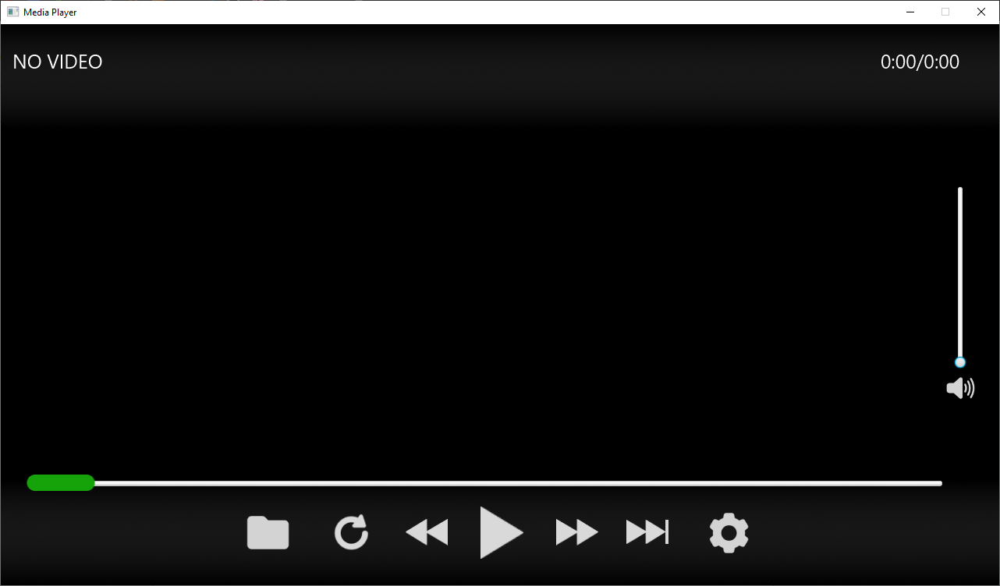
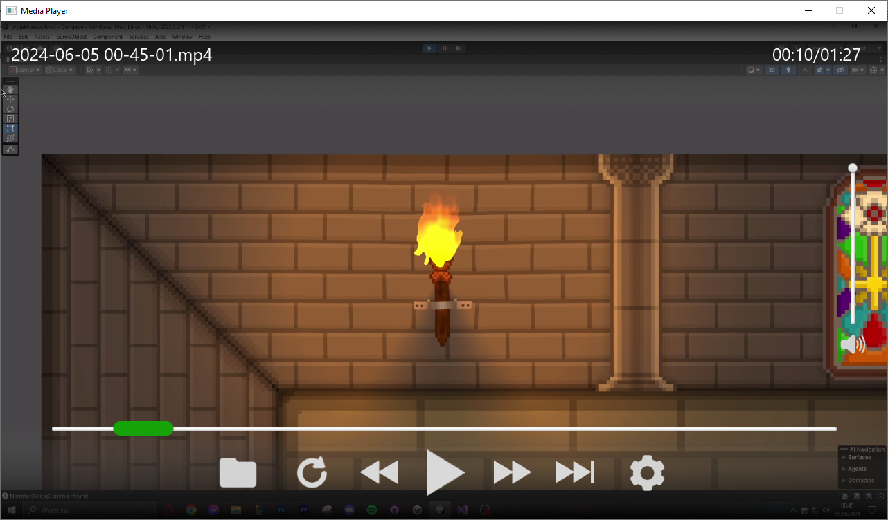
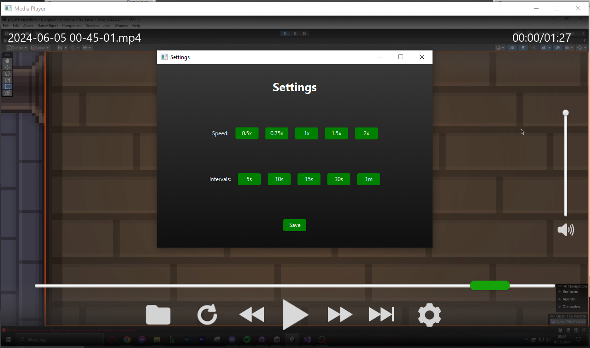

# Movie Player  

**PL:**  
Minimalistyczny odtwarzacz filmów stworzony w JavaFX, oferujący wszystkie kluczowe funkcje dostępne w komercyjnych odtwarzaczach. Odtwarzacz posiada intuicyjny interfejs, obsługę popularnych formatów i kontrolę głośności i prędkości.

**EN:**  
A minimalist movie player built with JavaFX, offering all key features available in commercial players. The player has an intuitive interface, supports popular formats, and includes volume and speed control.

### Screenshots

